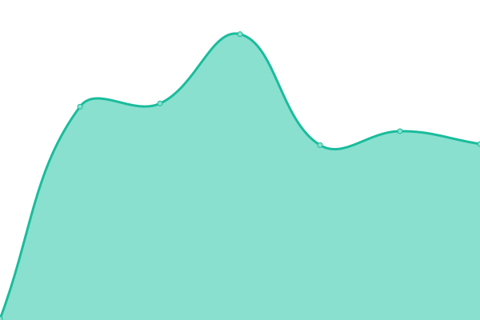

# [📈 Live Status](https://status.fabrizioduroni.it): <!--live status--> **🟩 All systems operational**

This repository contains the open-source uptime monitor and status page for [Fabrizio Duroni](https://www.fabrizioduroni.it), powered by [Upptime](https://github.com/upptime/upptime).

With [Upptime](https://upptime.js.org), you can get your own unlimited and free uptime monitor and status page, powered entirely by a GitHub repository. We use [Issues](https://github.com/chicio/chicio.status.github.io/issues) as incident reports, [Actions](https://github.com/chicio/chicio.status.github.io/actions) as uptime monitors, and [Pages](https://status.fabrizioduroni.it) for the status page.

<!--start: status pages-->
<!-- This summary is generated by Upptime (https://github.com/upptime/upptime) -->
<!-- Do not edit this manually, your changes will be overwritten -->
<!-- prettier-ignore -->
| URL | Status | History | Response Time | Uptime |
| --- | ------ | ------- | ------------- | ------ |
|  [Fabrizio Duroni](https://www.fabrizioduroni.it) | 🟩 Up | [fabrizio-duroni.yml](https://github.com/chicio/chicio.status.github.io/commits/master/history/fabrizio-duroni.yml) | 

 205ms
     
 | 

<a href="https://status.fabrizioduroni.it/history/fabrizio-duroni">100.00%</a>
    

|  [Chicio Coding Blog](https://www.fabrizioduroni.it/blog/) | 🟩 Up | [chicio-coding-blog.yml](https://github.com/chicio/chicio.status.github.io/commits/master/history/chicio-coding-blog.yml) | 

 28ms
     
 | 

<a href="https://status.fabrizioduroni.it/history/chicio-coding-blog">100.00%</a>
    

<!--end: status pages-->

[**Visit our status website →**](https://status.fabrizioduroni.it)

## 📄 License

- Powered by: [Upptime](https://github.com/upptime/upptime)
- Code: [MIT](./LICENSE) © [Fabrizio Duroni](https://www.fabrizioduroni.it)
- Data in the `./history` directory: [Open Database License](https://opendatacommons.org/licenses/odbl/1-0/)
